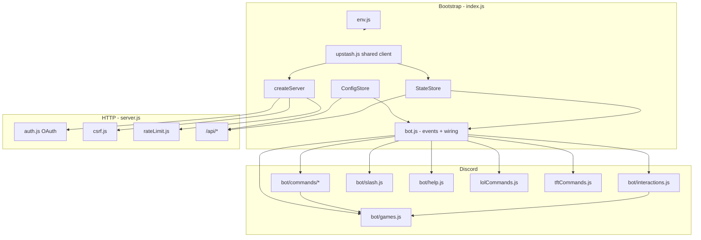

# Architecture

Discord service bot: một process Node.js chạy **Discord bot** + **Express dashboard** song song.

## Layer diagram



## Module responsibilities

| Module | Role |
|--------|------|
| `index.js` | Boot, env validation, **single** Upstash client, graceful shutdown |
| `bot.js` | Discord client, events, slash/prefix routing (~320 lines) |
| `bot/commands/index.js` | Dispatches built-in commands via domain handlers |
| `bot/commands/handlers/*.js` | help, general, moderation, levels, economy, panels, riot |
| `bot/interactions.js` | Help select menu, tickets, self-roles, game buttons |
| `bot/logging.js` | Log channel formatting and delivery |
| `bot/embeds.js` | Server/user/avatar embed builders |
| `bot/games.js` | Economy games, session state, blackjack/poker button handlers |
| `bot/slash.js` | Slash command registration definitions |
| `bot/help.js` | Help menu embed + group metadata |
| `bot/music/lavalink.js` | Lavalink v4 manager init, voice event forwarding, query builder |
| `configDefaults.js` | Default guild schema, command type registry |
| `configStore.js` | Per-guild config JSON, normalization, **secrets in RAM only** |
| `stateStore.js` | Warnings, XP, economy, tickets, game sessions, LoL/TFT links |
| `server.js` | Dashboard API, static assets, CSRF, rate limits |
| `auth.js` | Discord OAuth2 or dev bypass (`ALLOW_DEV_AUTH`) |
| `commandAccess.js` | Staff command gates, role hierarchy |
| `riot/helpers.js` | Shared Riot command UX (errors, summoner input) |
| `asyncMutex.js` / `distributedLock.js` | Concurrency primitives |

## Data flow

1. **Config** — `configs.json` (per guild), API keys via env or dashboard → `_runtimeSecrets` (not on disk).
2. **State** — Upstash Redis in production (`guild:{id}` JSON blobs) or `state.json` locally.
3. **Commands** — Prefix + slash → `getGuildConfig` → `bot/commands.runBuiltInCommand` → `stateStore` mutations under locks.

## Concurrency model

| Resource | Single instance | Multi-instance (Redis) |
|----------|-----------------|-------------------------|
| Economy debit/credit | `asyncMutex` per user | `withRedisLock` per user |
| Game button handlers | `StateStore.withGameSessionLock` (in-process mutex) | `withRedisLock` per game message when Upstash configured |
| API rate limit | Memory map | Upstash `INCR` + `EXPIRE` |

## Known technical debt (prioritized)

1. **`scripts/commands-body.txt`** — Source slice for handler recovery; regenerate handlers via `node scripts/recover-commands.mjs` after edits.
2. **`public/dashboard/`** — Dashboard split into ES modules; no bundler (browser-native imports).

## Security boundaries

- Dashboard: OAuth + session cookie + CSRF on writes + guild `ManageGuild` check.
- Bot: Discord permissions + `commandAccess` + optional `allowedRoles` per command.
- See [SECURITY_AUDIT.md](SECURITY_AUDIT.md).

## Deployment (Render)

- `render.yaml`: `NODE_ENV=production`, disk at `/var/data`, health `GET /health`.
- Required: OAuth, `SESSION_SECRET`, Upstash, `DISCORD_TOKEN`.
- Music: requires a Lavalink v4 server. Set `LAVALINK_HOST`, `LAVALINK_PASSWORD`.
  - Self-host Lavalink on Railway/Fly.io free tier (Java 17+).
  - Or use a public Lavalink node for testing (see [lavalink.darrennathanael.com](https://lavalink.darrennathanael.com/NoSSL/lavalink-without-ssl/)).
  - `application.yml` in project root is the Lavalink server config template.

## Audio pipeline

```
User message  →  bot.js prefix handler  →  music.js handleMusicCommand
                                                  ↓
                                         lavalink.js (lavalink-client)
                                                  ↓  REST + WebSocket
                                         Lavalink Server (Java)
                                                  ↓  youtube-source plugin
                                         YouTube / SoundCloud / Spotify*
                                         (* Spotify = metadata → YT audio via LavaSrc)
```
